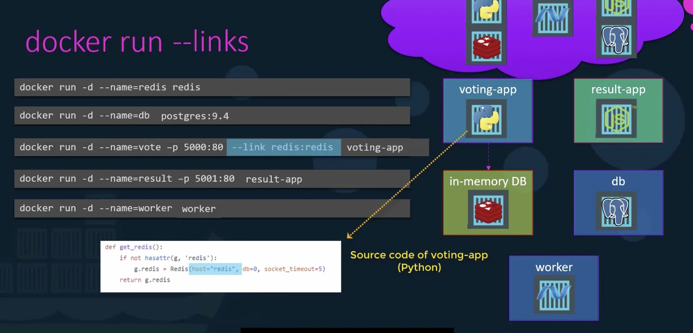

### What is Docker Link?

Docker Link is a legacy feature that allows containers to communicate with each other by creating a secure tunnel between them. It enables one container to access another container's exposed ports and environment variables. However, Docker Links have been largely replaced by Docker Networks, which provide more flexibility and scalability for container communication.

Docker Links work by creating an entry of the internal IP address of the linked container in the `/etc/hosts` file of the container that is linking to it. This allows the containers to resolve each other by name and communicate directly.

**Note:** It is recommended to use Docker Networks instead of Links for modern applications.

